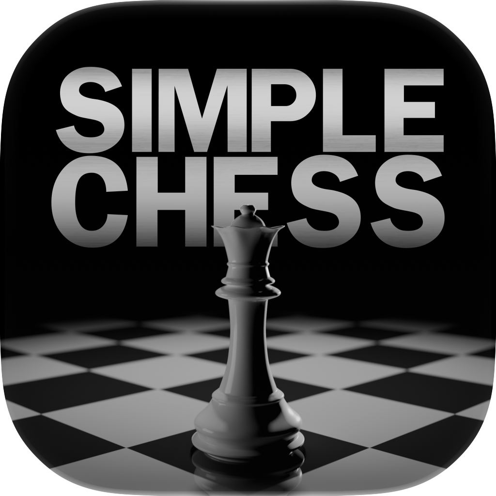

<p align="center">
  
</p>

<h1 align="center">SimpleChess</h1>

<p align="center">A UCI chess engine in C++20 with a custom, self-play-trained neural-network evaluation.</p>

---

SimpleChess pairs a modern, heavily-tuned alpha-beta search with a from-scratch
NNUE evaluation trained entirely on the engine's own self-play. Board representation
and legal move generation come from a vendored, header-only move-generation
library. The engine is tuned for Apple Silicon but builds and runs anywhere with
a C++20 compiler.

## Features

- **Evaluation** — a custom NNUE: a HalfKAv2_hm input (king-bucketed and
  mirrored) extended with threat and pawn-pair features, a 512-wide accumulator,
  and int8 SIMD inference (NEON on Apple Silicon).
- **Search** — iterative-deepening alpha-beta with aspiration windows, null-move
  pruning, late-move reductions, SEE-based pruning, a transposition table,
  killer / history / continuation move ordering, and lazy-SMP multithreading.
- **UCI** — speaks the UCI protocol; drop it into any UCI GUI (Cute Chess,
  BanksiaGUI, En Croissant, Arena).
- Optional Polyglot opening book support — off by default; no book ships, bring your own.

## Build

The Makefile is the primary build path — no CMake required. Requires a C++20
compiler (Apple clang works out of the box).

```sh
make            # optimized native build   ->  ./simplechess
make debug      # -O0 -g with ASan/UBSan and assertions
make clean
```

For the fastest (shipping) binary, use the profile-guided build:

```sh
make profile-build PGO_NET=nets/SCNNUEv2-5.scn5
```

The release build uses `-O3 -flto -mcpu=native`; retarget the architecture with,
e.g., `make ARCH="-mcpu=apple-m2"` or `make ARCH="-march=x86-64-v3"`.
`profile-build` additionally needs Python 3 with
[python-chess](https://pypi.org/project/chess/) (`pip install chess`) for its
training workload. A `CMakeLists.txt` is provided for IDE / CMake users.

## Run

```sh
./simplechess
```

```
uci
position startpos
go depth 12
```

The network is loaded automatically from `nets/SCNNUEv2-5.scn5` (next to the
binary or under `nets/`) — it ships in the repo, so the engine runs out of the
box. Point the `EvalFile` option at another file to use a different network.

## UCI options

| Option | Default | Meaning |
|---|---|---|
| `Hash` | 4096 | transposition-table size, in MB |
| `Threads` | 8 | search threads (lazy SMP) |
| `Move Overhead` | 30 | ms reserved for GUI / network lag |
| `Ponder` | false | think on the opponent's clock |
| `OwnBook` | false | opt in to a Polyglot book (none ships) |
| `Book File` | *(none)* | path to a Polyglot book, if you supply one |
| `EvalFile` | nets/SCNNUEv2-5.scn5 | network file to load |
| `RootNoise` | 0 | root-move score jitter (cp) for varied play |
| `NNUEWeight` / `NNUEScale` / `MaterialBlend` | 100 / 100 / 0 | advanced evaluation-blend knobs |

## The network

`nets/SCNNUEv2-5.scn5` is the pre-quantized int8 playing network (file magic
`SCN5`), committed to the repo so the engine works immediately after a clone or
"Download ZIP." It is trained from the engine's own self-play; the trainer and
training data are developed separately and are not part of this repository.

## License

Licensed under the **GNU General Public License v3.0** — see
[LICENSE](LICENSE).

Author: **Sam Moore**
